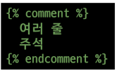

# 0315

# Django 구조 이해하기 (MTV Desing Pattern)

## Design Pattern

### Design Pattern 이란?

자주 사용되는 구조를 일반화해서 하나의 공법으로 만들어 둔 것

- 소프트웨어에서의 관점
  
  - 각기 다른 기능을 가진 다양한 응용 소프트웨어를 개발할 때 공통적인 설계 문제가 존재하며, 이를 처리하는 해결책 사이에도 공통점이 있다는 것을 발견
  
  - 이러한 유사점을 패턴 이라 함

### 소프트웨어 디자인 패턴

- 소프트웨어에도 자주 사용되는 구조와 해결책이 있음

- <u>클라이언트 - 서버 구조</u>도 소프트웨어 디자인 패턴 중 하나

- 자주 사용되는 소프트웨어의 구조를 일반적인 구조화를 해둔 것

### 소프트웨어 디자인 패턴의 목적

- 특정 문맥에서 공통적으로 발생하는 문제에 대해 재사용 가능한 해결책을 제시

- 프로그래머가 어플리케이션이나 시스템을 디자인할 때 발생하는 공통된 문제들을 해결하는데 형식화 된 가장 좋은 관행

### 소프트웨어 디자인 패턴의 장점

- 디자인 패턴을 알고 있다면 서로 복잡한 커뮤니케이션이 매우 간단해짐

- <mark>다수의 엔지니어들이 일반화된 패턴으로 소프트웨어 개발을 할 수 있도록 한 규칙, 커뮤</mark>니케이션의 효율성을 높이는 기법

## Django's Desing Pattern

### Django에서의 디자인 패턴

- django에도 이러한 디자인 패턴이 적용되어 있는데 django에 적용된 디자인 패턴은 **MTV패턴** ( M : model(data), T : templete(.html, 보여지는 것), V : view(logic) )

- MTV 패턴은  **MVC 디자인 패턴** 을 기반으로 조금 변형된 패턴

### MVC 소프트웨어 디자인 패턴

- MVC : Model - View - Controller 

- 데이터 및 논리 제어를 구현하는데 널리 사용되는 소프트웨어 디자인 패턴

- 하나의 큰 프로그램을 세가지 역할로 구분한 개발 방법론
  
  1. Model : 데이터와 관련된 로직을 관리
  
  2. View : 레이아웃과 화면을 처리
  
  3. Controller : 명령을 model과 view 부분으로 연결

### MVC 소프트웨어 디자인 패턴의 목적

- "관심사 분리"

- 더 나은 업무의 분리와 향상된 관리를 제공

- 각 부분을 독립적으로 개발할 수 있어, 하나를 수정하고 싶을 때 모두 건들지 않아도 됨

        == 개발 효율성 및 유지보수가 쉬워짐

        == 다수의 멤버로 개발하기 용이함

### django에서의 디자인 패턴

- django는 MVC 패턴을 기반으로 한 MTV 패턴을 이용, 두 패턴은 서로 크게 다른 점은 없으며 일부 역할에 대해 부르는 이름이 다름

        

### MTV 디자인 패턴

- Mode
  
  - MVC 패턴에서 Model의 역할에 해당
  
  - 데이터와 관련된 로직을 관리
  
  - 응용프로그램의 데이터 구조를 정의하고 데이터베이스의 기록을 관리

- Template
  
  - 레이아웃과 화면을 처리
  
  - 화면상의 사용자 인터페이스 구조와 레이아웃을 정의
  
  - MVC 패턴에서 View의 역할에 해당

- View
  
  - Model & Template과 관련한 로직을 처리해서 응답을 반환
  
  - 클라이언트의 요청에 대해 처리를 분기하는 역할
  
  - 동작 예시
    
    - 데이터가 필요하다면 model에 접근해서 데이터를 가져오고 가져온 데이터를 template로 보내 화면을 구성하고 구성된 화면을 응답으로 만들어 클라이언트에게 반환
  
  - MVC 패턴에서 Controller의 역할에 해당

                

### 정리

- django는 MTV 디자인 패턴을 가지고 있음
  
  - Model : 데이터 관련
  
  - Template : 화면 관련
  
  - View : Model & Template 중간 처리 및 응답 반환

## Django Template

### Django Template

- "데이터 표현을 제어하는 도구이자 표현에 관련된 로직"

- Django Template을 이용한 HTML 정적 부분과 동적 컨텐츠 삽입

- Template System의 기본 목표를 숙지

: Django Template System

    => 데이터 표현을 제어하는 도구이자 표현에 관련된 로직을 담당

 

### Django Temaplte Language(DTL)

- Django Template에서 사용하는 built-in template system

- 조건, 반복, 변수 치환, 필터 등의 기능을 제공
  
  - python처럼 일부 프로그래밍 구조(if, for 등)를 사용할 수 있지만 이것은 **Python 코드로 실행되는 것이 아님**
  
  - DJango 템플리 시스템은 단순히 Python이 HTML에 포함된 것이 아니니 주의

- 프로그래밍적 로직이 아니라 프레젠테이션을 표현하기 위한 것임을 명힘

 

### DTL Syntax

1. Variable : 변수

2. Filters

3. Tags

4. Comments : 주석

 

### Variable

- 변수명은 영어, 숫자와 밑줄(_)의 조합으로 구성될 수 있으나 밑줄로는 시작 할 수 없음
  
  - 공백이나 구두점 문자 또한 사용 X

- dot(.)를 사용하여 변수 속성에 접근할 수 있음

        
        - 리스트일때 : info.0 으로 인덱스 표시

- render()의 세번째 인자로 {'key' : value}와 같이 딕셔너리 형태로 넘겨주며, 여기서 정의한 key에 해당하는 문자열이 template에서 사용 가능한 변수명이 됨

### Filters

- 표시할 변수를 수정할 때 사용

- 예시)
  
  - name 변수를 모두 소문자로 출력
    
     
  
  - age 변수에 2를 더해서 출력

                

- 60개의 built-in template filters를 제공 : 공식문서 (django filter docs)

- chained가 가능하며 일부 필터는 인자를 받기도 함

        

 

### Tags

- 출력 텍스트를 만들거나, 반복 또는 논리를 수행하여 제어 흐름을 만드는 등 변수보다 복잡한 일들을 수행

- 일부 태그는 시작과 종료 태그가 필요

        

        for : ? 

- 약 24개의 built-in template tags를 제공

 

### Comments

- Django template에서 라인의 주석을 표현하기 위해 사용

- 아래처럼 유효하지 않은 템플릿 코드가 포함될 수 있음

        

- 한 줄 주석에만 사용할 수 있음 (줄 바꿈이 허용되지 않음)

- 여러 줄 주석은  와  사이에 입력

        

 

## Template inheritance

### 템플릿 상속

- 템플릿 상속은 기본적으로 코드의 재사용성에 초점을 맞춤

- 템플릿 상속을 사용하면 사이트의 모든 공통 요소를 포함하고, 하위 템플릿이 재정의(override) 할 수 있는 블록을 정의하는 기본 'skeleton' 템플릿을 만들 수 있음

- 만약 모든 템플릿에 부트스트랩을 적용하려면 어떻게 해야 할까?
  
  - 모든 템플릿에 부트스트랩 CDN을 작성해야 할까?

 

### 템플릿 상속에 관련된 태그

- 자식(하위)템플릿이 부모 템플릿을 확장한다는 것을 알림

- <mark>반드시 템플릿 최상단에 작성되어야 함(즉, 2개 이상 사용할 수 없음)</mark>

- 하위 템플릿에서 재지정(overridden) 할 수 있는 블록을 정의

- 즉, 하위 템플릿이 채울 수 있는 공간

- 가독성을 높이기 위해 선택적으로 endblock 태그에 이름을 지정할 수 있음

### Django는 Template을 어떻게 처리하는 걸까?

